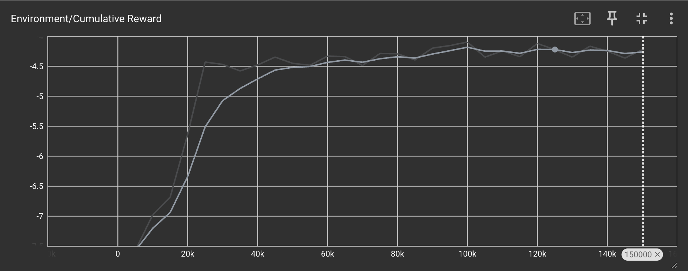
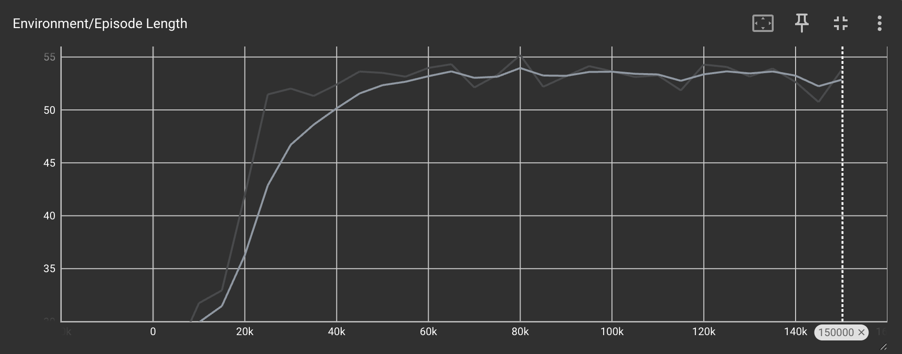

Jumper
======

Overzicht
--------

**Jumper** is een 2D-simulatieomgeving waarin een AI-agent de vaardigheid ontwikkelt om over bewegende hindernissen te springen. In deze virtuele wereld bevindt de agent zich op een platform en moet deze leren om bewegende obstakels te ontwijken door strategisch te springen. Het systeem is zo opgezet dat de agent niet alleen leert om te springen, maar ook om dit op een efficiënte manier te doen, waarbij overmatig springen wordt ontmoedigd.

### Leerdoelen

De AI-agent streeft naar:

-   Effectief ontwijken van bewegende hindernissen door middel van sprongen.
-   Optimalisatie van energieverbruik door alleen te springen wanneer nodig.
-   Maximale overlevingsduur door botsingen te voorkomen.

### Beloningssysteem

-   Precisiesprong: +0.15 tot +0.3 punten, gebaseerd op de nauwkeurigheid van de timing.
-   Overbodige sprong: -0.4 punten.
-   Aaneengesloten sprongen: -0.1 * aantal opeenvolgende sprongen (ter ontmoediging van spammen).
-   Gemiste sprong: -0.3 punten bij te laat reageren op een naderend obstakel.
-   Succesvol ontwijken: +3.0 punten bij het veilig passeren van een obstakel.
-   Botsing: -6.0 punten bij contact met een obstakel (einde sessie).
-   Tijdsbeloning: +0.01 punten per frame voor overleving.
-   Stapkosten: -0.01 punten per beslissing voor efficiëntie.

### Beschikbare Acties

De agent kan twee verschillende acties uitvoeren:

-   0: Stil blijven staan.
-   1: Een sprong maken.

### Waarnemingsgegevens

De agent heeft toegang tot de volgende informatie:

-   Coördinaten van de agent (x, y).
-   Bewegingssnelheid van de agent (x, y).
-   Locatie van het eerstvolgende obstakel (x, y).
-   Bewegingssnelheid van het obstakel (x, y).
-   Grondcontact status.
-   Beschikbare energie.
-   Aantal opeenvolgende sprongen.

Totaal aantal waarnemingen: 11.

Installatie en Configuratie
--------------------------

### Systeemeisen

-   Unity: Versie 2022.3 of nieuwer (getest met Unity 6).
-   ML-Agents: Unity ML-Agents toolkit (versie 2.0+).
-   Python: Versie 3.8 of hoger.
-   ML-Agents Python package: ml-agents (versie 0.30.0+).

### Installatiestappen

1.  Download de code: git clone: cd <project-map>
2.  Project openen in Unity:
    -   Start Unity Hub.
    -   Kies "Add" en selecteer de projectmap.
    -   Open het project met Unity 2022.3 of nieuwer.
    -   Open de scène: Assets/Scenes/JumperScene.unity.
3.  Python-pakket installeren:
    -   Controleer Python 3.8+ installatie.
    -   Installeer ml-agents: pip install mlagents

### Handmatige Testmodus

1.  Open JumperScene in Unity.
2.  Selecteer het JumperAgent object.
3.  Stel Behavior Type in op Heuristic Only.
4.  Start de simulatie.
5.  Gebruik de spatiebalk voor sprongen.

### Trainingsprocedure

1.  Zet Behavior Type op Default.
2.  Open een terminal in de projectmap.
3.  Start training: mlagents-learn config/jumper.yaml --run-id=JumperTraining --force
4.  Start de simulatie in Unity.
5.  Training duurt 150.000 stappen.

### Resultatenanalyse

1.  Start TensorBoard: tensorboard --logdir results
2.  Open http://localhost:6006 in je browser.
3.  Analyseer de grafieken onder Scalars.

Trainingsresultaten
------------------

De agent is getraind over 150.000 stappen met het PPO-algoritme. De uiteindelijke gemiddelde beloning (smoothing 0.6) bedroeg -4.224, wat aangeeft dat de agent nog in ontwikkeling is maar wel effectief leert om overmatig springen te voorkomen.

### Beloningsgrafiek

### Sessieduur

Referenties
----------

-   [ML-Agents Handleiding](https://github.com/Unity-Technologies/ml-agents/blob/develop/docs/Learning-Environment-Examples.md)
-   [Unity Handleiding](https://docs.unity3d.com/Manual/index.html)